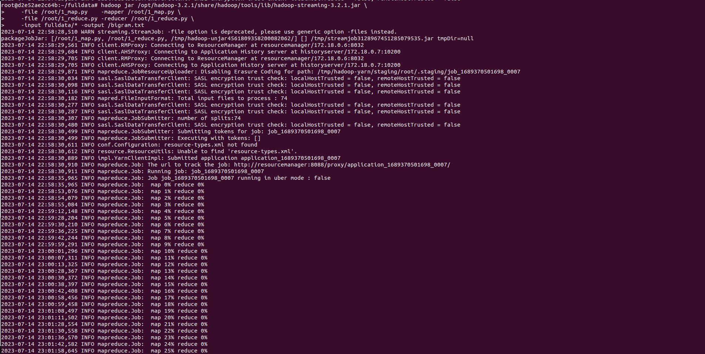

# Laboratorio 03 - Big Data

## Integrantes

- Angel Tomas Concha Layme


## Configuración de un Clúster de Hadoop en Docker y Análisis de Datos

Este documento describe los pasos para configurar un clúster de Hadoop en Docker, y realizar el análisis de datos utilizando MapReduce. 


## 1. Configuración del Clúster Hadoop


Para configurar el clúster de Hadoop, utilizamos Docker Compose. La configuración completa se encuentra en un archivo YAML, pero los principales componentes incluyen:

- `namenode:` Es el nodo que administra el sistema de archivos y controla el acceso a los archivos por parte de los clientes.
- `datanode y datanode2:` Estos son los nodos que almacenan y recuperan bloques de datos cuando los solicitan los clientes.
- `resourcemanager:` Se encarga de la asignación de recursos en el clúster.
- `nodemanager:`  Ejecuta las tareas en cada nodo de datos en el clúster.
- `historyserver:` Administra la información de las tareas completadas.


Los volúmenes Docker (`hadoop_namenode`, `hadoop_datanode`, `hadoop_datanode2`, `hadoop_historyserver`) permiten que los datos persistan más allá de la vida de los contenedores individuales. Si tienes que reiniciar o eliminar alguno de tus contenedores, los datos no se perderán.

Para iniciar el clúster, se ejecuta el siguiente comando en la terminal:

```shell
docker-compose up -d
```

Para verificar el estado de lso servicios se ejecuta:
```shell
docker ps
```

EL resultado deberia ser similar a:
```
CONTAINER ID   IMAGE                                                    COMMAND                  CREATED        STATUS                 PORTS                                                                                  NAMES
63e080d1872d   bde2020/hadoop-datanode:2.0.0-hadoop3.2.1-java8          "/entrypoint.sh /run…"   29 hours ago   Up 2 hours (healthy)   9864/tcp                                                                               datanode2
3fdd6d490904   bde2020/hadoop-nodemanager:2.0.0-hadoop3.2.1-java8       "/entrypoint.sh /run…"   30 hours ago   Up 2 hours (healthy)   8042/tcp                                                                               nodemanager
d2e52ae2c64b   bde2020/hadoop-namenode:2.0.0-hadoop3.2.1-java8          "/entrypoint.sh /run…"   30 hours ago   Up 2 hours (healthy)   0.0.0.0:9000->9000/tcp, :::9000->9000/tcp, 0.0.0.0:9870->9870/tcp, :::9870->9870/tcp   namenode
f5658609bf6d   bde2020/hadoop-datanode:2.0.0-hadoop3.2.1-java8          "/entrypoint.sh /run…"   30 hours ago   Up 2 hours (healthy)   9864/tcp                                                                               datanode
4afe69a052b9   bde2020/hadoop-historyserver:2.0.0-hadoop3.2.1-java8     "/entrypoint.sh /run…"   30 hours ago   Up 2 hours (healthy)   8188/tcp                                                                               historyserver
5881ef18d036   bde2020/hadoop-resourcemanager:2.0.0-hadoop3.2.1-java8   "/entrypoint.sh /run…"   30 hours ago   Up 2 hours (healthy)   8088/tcp                                                                               resourcemanager
```

Con el `CONTEINDER ID` podemos trabajar con los nodos individualmente, por ejemplo, para acceder al `namenode` se ejecuta:
```shell
docker exec -it d2e52ae2c64b bash
```

Una vez dentro del nodo, debemos instalar python, ya que el cluster no tiene instalado python por defecto. Para ello, ejecutamos los siguientes comandos:
```shell
sed -i 's/stable/updates/stable-security/updates/' /etc/apt/sources.list
sed -i s/deb.debian.org/archive.debian.org/g /etc/apt/sources.list
sed -i s/security.debian.org/archive.debian.org/g /etc/apt/sources.list
echo "deb http://archive.debian.org/debian stretch main contrib non-free" > /etc/apt/sources.list
apt update && apt install python3 -y
```


Tenemos que repetir el mismo proceso para todos los nodos del cluster

## 2. Cargar map.py y reduce.py en el clúster

Para cargar los archivos `map.py` y `reduce.py` en el clúster, se ejecuta el siguiente comando en la terminal:

```shell
docker cp map.py d2e52ae2c64b:/map.py
docker cp reduce.py d2e52ae2c64b:/reduce.py
```
Podemos copiar los datos a cualquier nodo del cluster, en este caso, se copiaron en el `namenode`, es importante recordar que los archivos deben tener permisos de ejecución, para ello, ejecutamos:
```shell
chmod +x map.py
chmod +x reduce.py
```


## 3. Cargar los datos en el clúster
Para cargar los datos en el clúster, se ejecuta el siguiente comando en la terminal:
```shell
docker cp fulldata d2e52ae2c64b:/data
```

Una vez copiados los datos, tenemos que subirlos al HDFS, para ello, ejecutamos:
```shell
hdfs dfs -put /data fulldata
```


## 4. Ejecutar el análisis de datos
Para ejecutar el análisis de datos, se ejecuta el siguiente comando en la terminal:
```shell
hadoop jar /opt/hadoop-3.2.1/share/hadoop/tools/lib/hadoop-streaming-3.2.1.jar \
    -file /root/1_map.py    -mapper /root/1_map.py \
    -file /root/1_reduce.py -reducer /root/1_reduce.py \
    -input fulldata/* -output /bigram_output
```

La primera parte del comando, ejecuta el jar de hadoop, la segunda parte, indica los archivos que se van a utilizar, en este caso, `map.py` y `reduce.py`, la tercera parte, indica el directorio de entrada y la salida. En nuestra configuracion de docker, el directorio de entrada es `/data` y el directorio de salida es `/bigram.txt`, map.py y reduce.py se encuentran en el directorio `/root` con el nombre `1_map.py` y `1_reduce.py` respectivamente (para el problema 1: bigramas)

El resultado de la ejecución se puede ver en la siguiente imagen:





EL tiempo de ejecución fue de 48 minutos aproximadamente.


## 5. Descargar los resultados
Para descargar los resultados, se ejecuta el siguiente comando en la terminal:
```shell
docker cp d2e52ae2c64b:/bigram_output/part-00000 ./bigram_output 
```


## 6. Eliminar el clúster
Para eliminar el clúster, se ejecuta el siguiente comando en la terminal:
```shell
docker-compose down
```


